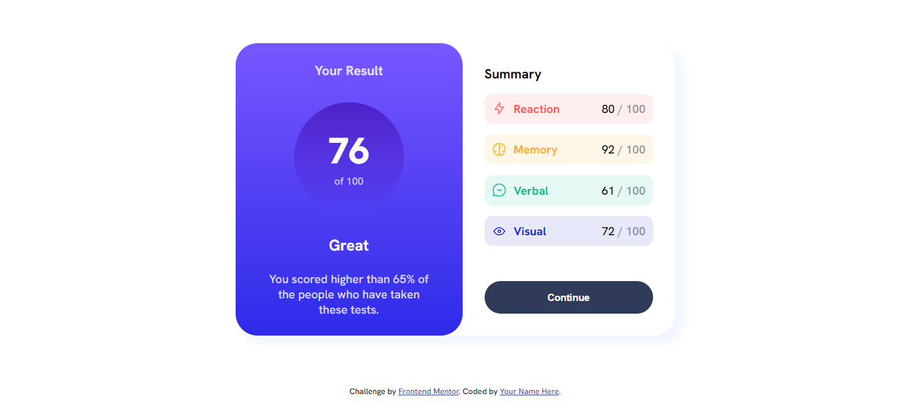

# Frontend Mentor - Results summary component solution

This is a solution to the [Results summary component challenge on Frontend Mentor](https://www.frontendmentor.io/challenges/results-summary-component-CE_K6s0maV). Frontend Mentor challenges help you improve your coding skills by building realistic projects. 

## Table of contents

- [Overview](#overview)
  - [The challenge](#the-challenge)
  - [Screenshot](#screenshot)
  - [Links](#links)
- [My process](#my-process)
  - [Built with](#built-with)
  - [What I learned](#what-i-learned)
  - [Continued development](#continued-development)

## Overview

### The challenge

Users should be able to:

- View the optimal layout for the interface depending on their device's screen size
- See hover and focus states for all interactive elements on the page

### Screenshot



### Links

- Solution URL: [https://github.com/erikathomas/frontend-mentor-results-summary-component](https://github.com/erikathomas/frontend-mentor-results-summary-component)
- Live Site URL: [Add live site URL here](https://your-live-site-url.com)

## My process

### Built with

- Semantic HTML5 markup
- CSS custom properties
- Flexbox
- Mobile-first workflow

### What I learned

This project helped me to deeper my knowledge about flexbox and mobile first design approach. 

To see how you can add code snippets, see below:

```css
body {
    display: flex;
    align-items: center;
    justify-content: center;
    flex-direction: column;
    height: 100vh;
}
```
### Continued development

I would like to continue improving my flexbox skills by building more projects with complex layouts. 
